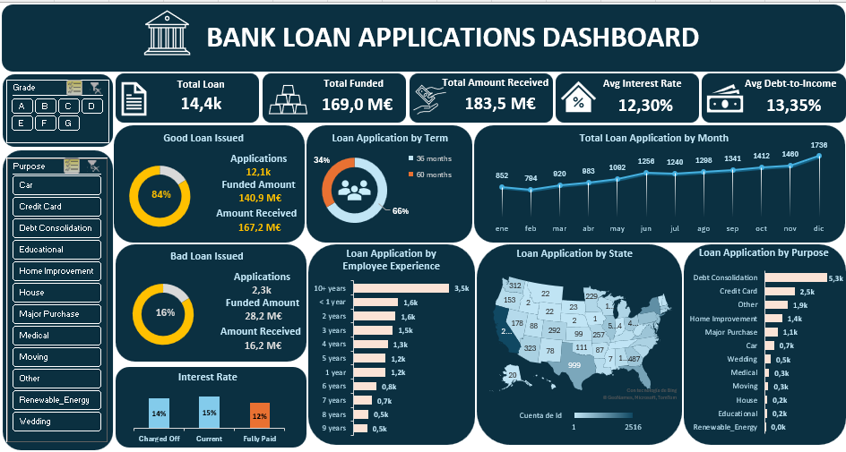
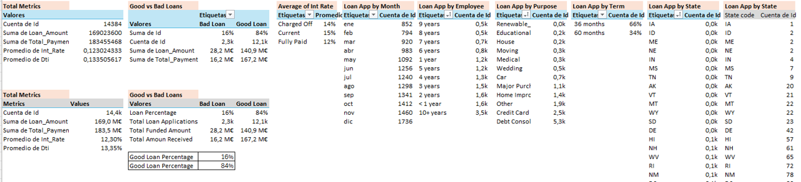
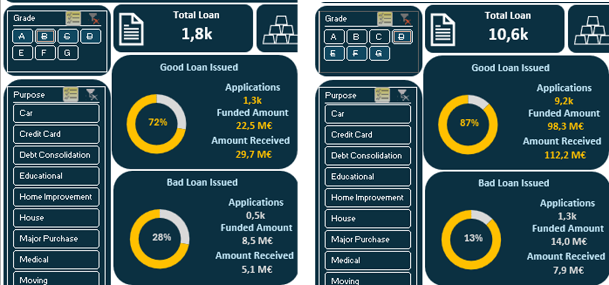

# Excel Project.

<h1>📊 Executive Bank Loan Applications Dashboard in Excel </h1>

	This project focuses on preparing, cleaning, analyzing bank financial data, and building an interactive dashboard in Excel. Key business insights are also highlighted.
    

  

---
<h2>🛠️ Data preparation in Excel</h2>
<i>1. Importing data </i>  
The raw dataset was reviewed in Excel to understand its structure, identify irrelevant columns, and set appropriate data types, specially the correct date format.

<i>2. Data Cleaning</i>  

**Steps included:**

1. **Removing duplicates**
- No duplicates were found.

2. **Standardizing data**
- Minor standardization like trimming spaces (=TRIM)or correcting capitalizations (=PROPER or =UPPER) was considered.

- Filters were used to check consistency in names and terms.

3. **Handling missing values**
- Using XLOOKUP or manual filters to address missing data based on context-appropriate methods such as imputation or row removal.

- For example, missing Grades were filled using the Sub_Grade column.

- Missing Interest Rates were inferred from similar rows when possible. 

4. **Removing rellevant Columns/Rows**
- Columns not relevant to the analysis were removed to simplify the dataset.

5. **Adding new colums**
- Created a Loan Quality Label based on the loan status:
=IF(OR([@[Loan_Status]]="Fully Paid", [@[Loan_Status]]="Current"), "Good Loan", IF([@[Loan_Status]]="Charged Off", "Bad Loan", ""))

---
<h2>📊 Pivot Tables for Key Metrics</h2>
Before building the dashboard, key performance indicators (KPIs) were defined. Then, PivotTables were used to summarize the data, using formatting (%, currency, thousands/millions) for clarity.

In this case, some of the identified Key Metrics are **Total Loan Amount, Total Funded Amount, Total Amount Received, Average Interest Rate, Debt-to-Income ratio (Good vs. Bad loans), Loans Counts by Employee, State, and Purpose, Monthly Loan Trends**

  

---
<h2>📈 Dashboard Development</h2>
Design principles:

- Focused on executive-level KPIs.
- Clean and intuitive layout.
- Dynamic filtering for exploration.

- Key metrics displayed using value cards: Total Loan, Total Funded amount, Total amount received, or Average Interest Rate.

Visuals include:

- KPI cards (e.g., Total Loans, Total Funded amount, Total amount received, or Average Interest Rate)
- Doughnut charts (e.g., Good vs. Bad Loans, Loan applications by term)
- Bar charts (e.g., Loans by employee experience, Loans by purpose)
- Line charts (e.g., Monthly trends)	
- Map charts
- Filters for dynamic analysis (e.g., Risk Grade and Loan Purpose)

---
<h2>✅ Key Insights from the Bank Loan Applications Dashboard</h2>

- The majority of loans are categorized as Good, with only 16% charged off. Although the reasons for these defaults are not specified, this represents a valuable area for further investigation.
Notably, 28% of loans in high-risk grades (E, F, G) were charged off, compared to just 13% in low-risk grades (A, B, C). Furthermore, 75% of all loans issued (10.6k out of 14.4k) fall into these low-risk categories.

- The number of loans issued increases progressively throughout the year, peaking in the final months.
- Loan issuance is highly concentrated in a few key states, with California, Texas, Florida, and New York leading in volume.
- Most loans are issued for debt consolidation, followed by those for credit card repayment.

🔍 <i>Opportunities for Further Analysis</i>  

- Identify trends in interest rates over time
- Analyze the correlation between interest rates and risk grades
- Evaluate employee performance based on loan outcomes and experience
- Investigate relationships among loan amount, interest rate, risk grade, and repayment status
- Explore factors contributing to charged-off loans